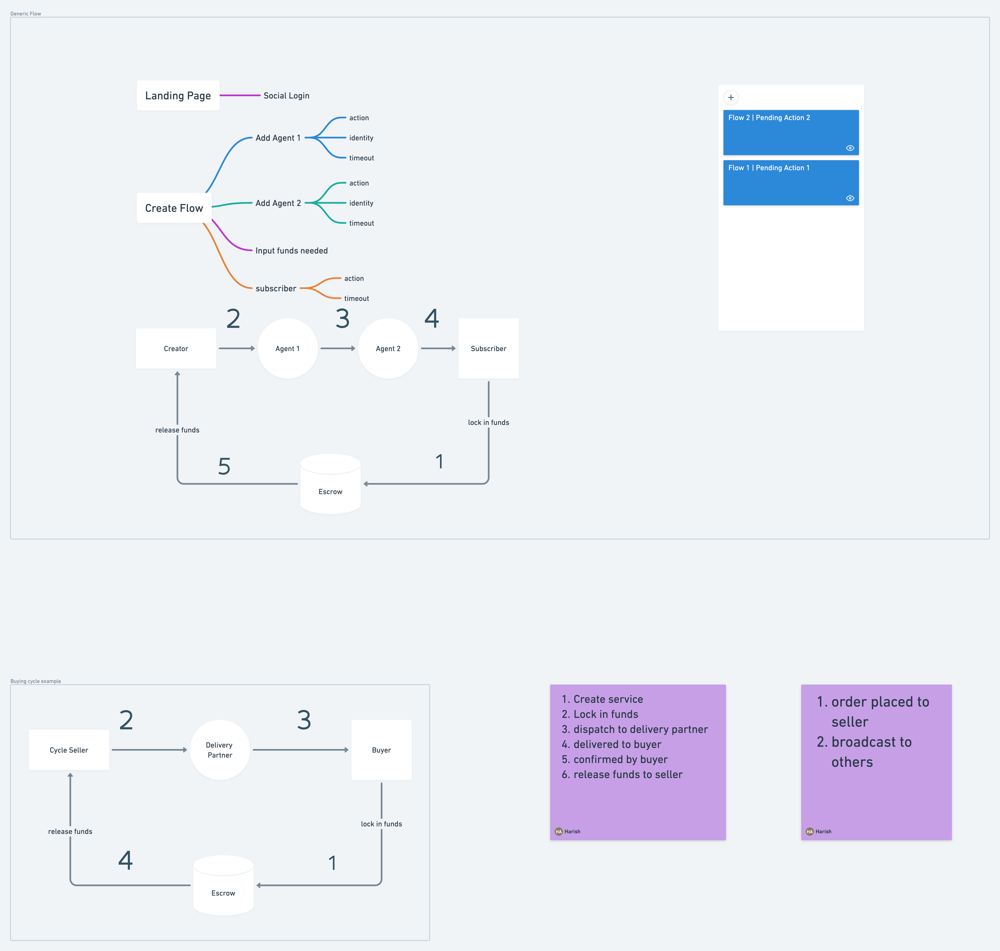

- [Overview](#overview)
    + [Actions](#actions)
    + [APIs](#apis)
    + [Services](#services)
    + [Notes](#notes)
- [Code Examples](#code-examples)
    + [Order Status states](#order-status-states)
    + [Sample service record](#sample-service-record)
    + [Sample order record](#sample-order-record)
- [API Requests](#api-requests)
    + [Create Service](#create-service)
    + [Create Order](#create-order)
    + [Process Action](#process-action)

<small><i><a href='http://ecotrust-canada.github.io/markdown-toc/'>Table of contents generated with markdown-toc</a></i></small>

<a href="https://whimsical.com/landing-page-GwUMnnkNSj34GLY6ioijWw@2Ux7TurymMm5Kkct9gRP">  </a>


# Overview

### Actions

1. **Boolean:** Simple Yes or No, the flow is stuck until yes is submitted


### APIs
 1. **Create Service**
 
    Used to create a service. It requires mandatory fields such as: agents info, agents & subscriber actions. 
     - this creates a service record.
 
 2. **Order a Service**
 
    Any potential subscriber can subscribe to the service. 
     - It copies the service template, adds subscriber info and creates an order record
     - Transfers the lockin funds from subscriber to Escrow
     - notifies seller about the order placement
 3. **Process a step**
 
    Any appropriate participant calls and submits their action response.
     - Validates and verifies participant and current step of the order
     - updates the state
     - broadcasts the update to all participants
 
 ### Services 
  1. Broadcaster Service (Push Protocol)

      - Takes in Target users ID, Message content as input
      - Broadcasts the message to all the targets
 
2. Check Order Expiry Cron

    - Runs periodically and identifies expired orders: if subsequent action hasnt happened within timeout.
    - Refunds the lockedin funds back to the buyer and updates the state


### Notes
- Once the order has been placed, every subsequent process steps needs to happen within a certain timeout or else the buyer funds will be reimbursed back from escrow.


# Code Examples

### Order Status states
```
const ORDER_STATUS = [
    "ORDER_PLACED",
    "FUNDS_LOCKEDIN",
    "CREATOR_ACK",
    "AGENT_ONE",
    "AGENT_TWO",
    "SUBSCRIBER_ACK",
    "FUNDS_RELEASED",
    "FUNDS_REFUNDED"
]
``` 
### Sample service record
```


const service = {
    id : "sell-cycle",
    lockinfunds: 100, // in MATIC
    creator: {
        id: "Firefox-cycles",
        action: "Boolean",
        wallet: "0x1231234123123bnn",
        timeout: '1 day', // step timeout
    },
    agents: [
        {
            id: "bluedart",
            wallet: "0x123123412cac",
            action: "Boolean",
            timeout: '3 days', // step timeout
        }
    ],
    subscriber: {
        action: "Boolean",
        timeout: '6 hours', // step timeout
    }
}
```
### Sample order record

```


const order = {    
    id: "sell-cycle-123",
    serviceId : "sell-cycle",
    lockinfunds: 100, // in MATIC
    status: ORDER_STATUS[0],
    creator: {
        id: "Firefox-cycles",
        action: "Boolean",
        wallet: "0x1231234123123bnn"
    },
    agents: [
        {
            id: "bluedart",            
            wallet: "0x123123412cac",
            action: "Boolean"
        }
    ],
    subscriber: {
        id: "gowtham",
        action: "Boolean",
        wallet: "0xdfsdf12313123123"
    }
}
```

# API Requests

### Create Service 

```
{
    "path" : "/service",
    "method": "PUT",
    "auth": "caller",
    "desc":"creates a service template for subscribers to subscribe to",
    "body" : {
        "creator": {
            "id": "caller-id",
            "action": "Boolean",
            "wallet": "caller-wallet"
        },
        "agents":[
            {
                "id": "bluedart",
                "wallet": "0x123123412cac",
                "action": "Boolean"
            }
        ],
        "subscriber": {
            "action": "Boolean"
        }
    },
    "response":{
        "succces":true
    }
}
```

### Create Order

```
{
    "path" : "/service/order",
    "method": "POST",
    "auth": "caller",
    "desc":"creates an order based on the service template",
    "body" : {
        "id":"caller-id"
    },
    "response":{
        "succces":true,
        "orderId": "sell-cycle-123"
    }
}
```

### Process Action

```
{
    "path" : "/service/action",
    "method": "POST",
    "auth": "caller",
    "desc":"for agents to process the steps",
    "body" : {
        "id":"caller-id",
        "orderId": "sell-cycle-123",
        "action" : true
    },
    "response":{
        "succces":true
    }
}
```
